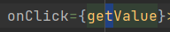

## RIBEYRON Hugo

### Tâches réalisés :

`Création d'une page qui permet de récupérer toute les villes présente dans une région depuis l'insertion d'un code postal`
- Pour ce faire j'ai utilisé une API qui s'appelle Zippopotam 
`https://zippopotam.us/`

- J'ai effectué un fetch sur l'adresse de l'API de manière à obtenir un résultat : 

- Mais pour obtenir ce résultat, j'ai mis en place un Input et un bouton (qui proviennent de BluePrint) rechercher permettant 
la saisie d'un code postale

- On peux voir que depuis le bouton je fais un appel à une methode getValue :

- Cette méthode récupère le code postale entrée dans l'input et le passe à la méthode replacePostalCodeOnApiAddress

- Cette méthode contient l'adresse de l'API en dur, sur laquelle on fais passer une regex qui remplace les 5derniers
chiffre présent dans l'adresse par le code postale entrée dans l'input, ce qui nous permet donc de choisir n'importe quelle
code postale : 

- Suite a ce traitement, on apelle la méthode fetchDataForCountryHandler depuis la méthode getValue en lui passant le
résultat de la méthode expliqué ci-dessus (soit, l'adresse de l'API contenant le code postale) :

- Une fois que tout le traitement a été fais, on obtient un objet qui est stocké dans un useState crée plus haut : 

- Ce useState va nous permettre d'effectuer un .map sur le résultat que nous avons obtenu de manière à itéré sur chaques ville
obtenue pour une région. Toutes ces villes vont être passé via une props à un component que j'ai crée, qui lui ne sert 
qu'à afficher les données dans une card de manière plus jolie : 
[img_7.png](img_7.png)

- Ce component, qui est une carrd importé depuis BluePrint récupère donc la props qui lui est passé et affiche les données 
contenue à l'intérieur :

- J'ai également crée une NavBard importé depuis BluePrint sur laquelle j'ai brancher un bouton login avec les routes de
manière a manipuler un peu ReactRouter :

- J'ai ensuite rajouté cette ligne dans le fichier main de manière a ce que ma route match avec un component, en l'occurence
ici il fallait que celle-ci match avec le component login : 

### Les + :
- Compréhension du framework REACT dans sa surface, il faut que je continue de pratiquer celui-ci chez moi de manière à
prendre en expérience notement sur le développement front. En entreprise je travaille avec du java et du angular, mais
je suis plus spécialiser sur le travail en BackEnd, je ne m'anipule que très peu angular, et le peu de fois ou je l'utilise
cest dans un code ou tout est déja existant, on va dire que je ne crée rien, je ne fais que brancher mon code backEnd sur
des composants déjà existant. C'est pour sa que je trouve que il est important que je profite de cette semaine de cours
pour continuer à pratiquer afin d'obtenir de l'expérience. 

### Les - :
- Encore beaucoup de points reste floue sur REACT notemment sur l'utilisation des HOOKS.
- Je n'ai pas compris exactement comment fonctionne le reducer malgré plusieur explication en cours. Mais je dispose de votre
projet exemple afin de pouvoir approfondir ce point-ci.

### Ressenti du cours
- Utilisation de GIT : il faut ABSOLUMENT que isitech mette en place un cours dédié au versionning, j'ai passé clairement énormément
de temp dans la semaine à expliquer / assisté les collègues de mon groupe sur l'utilisation de GIT. Je ne leurs jette pas la pierre
dessus loin de la car lorsque l'on ne l'utilise pas il est très compliqué d'en comprendre l'interêt et son utilisation.

- Découverte du développement WEB qui est quelque chose que je semble apprécié a première vue, hors mis la partie CSS qui
me repousse fortement mais je pense que c'est uniquement parce que je n'y connais rien pour le moment.

- J'ai trouvé que certaines explication était un peu vague mais je pense que cela était voulu de manière à ce que nous 
allions chercher dans la doc de react ou de BluePrint, c'est une méthode d'apprentissage que j'apprécie tout particulièrement
car cela nous permettais d'apprendre en nous trompant et même si nous avançions doucement, 
vous restiez conscient du niveau de chaque groupe et avez fait la part des choses.

