#LOPES ALVES Paulo

#Tâches réalisées dans le groupe

 * Mise en place de la SideBar

   * Gestion des routes
   
   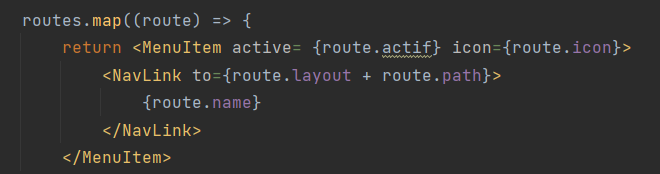
   
   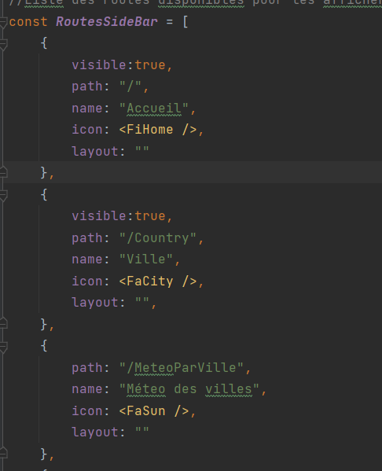
   

   * Utilisation des useState pour agrandir/retrecir la sideBar
   *Utilisation des props

   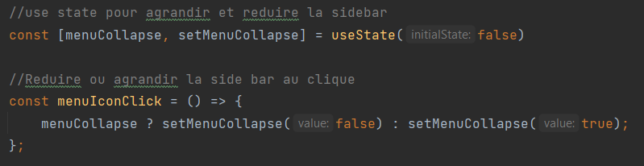

   * Les modules Css

   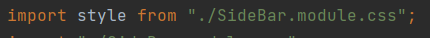

   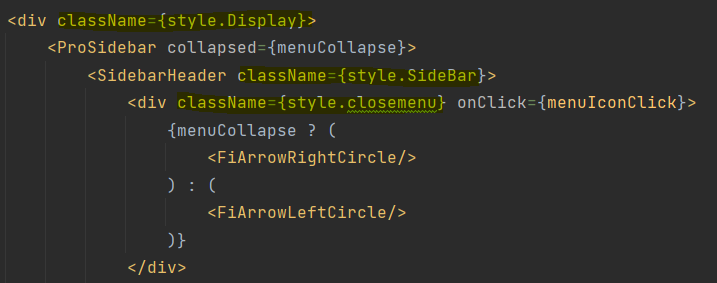

 * Création de l'aspect esthetique de la view login avec blueprint

    
   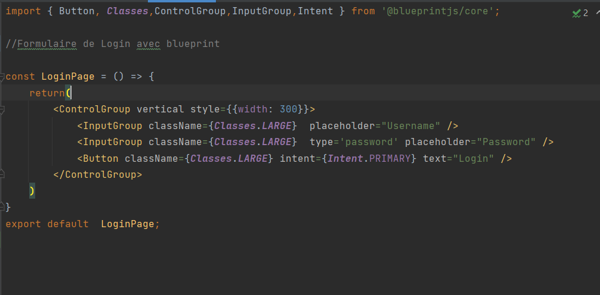

 * View utilisant des donées récupérés depuis une API
 
   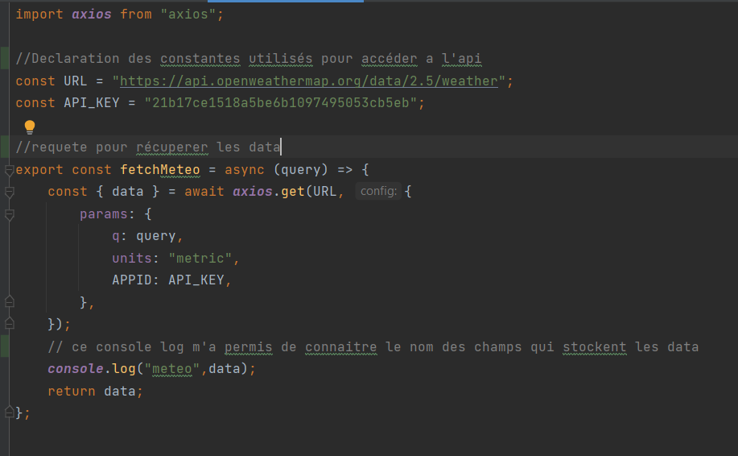

 * Structuration de l'affichage de la page app.js

   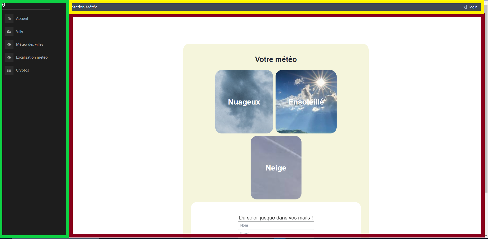

* Creation d'un component card pour englober les views souhaités et un component main pour faciliter l'affichage des views dans app.js

   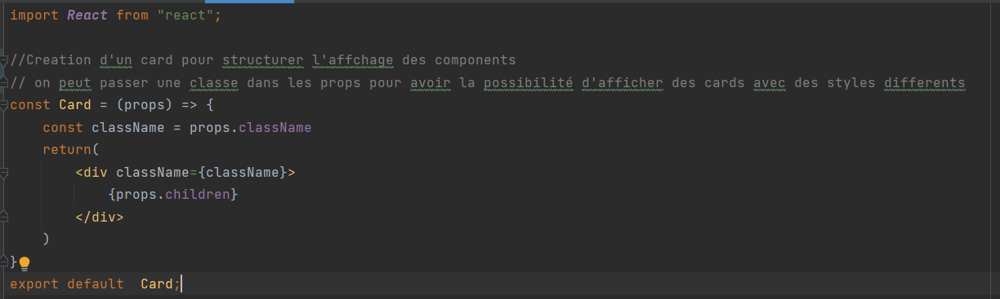

   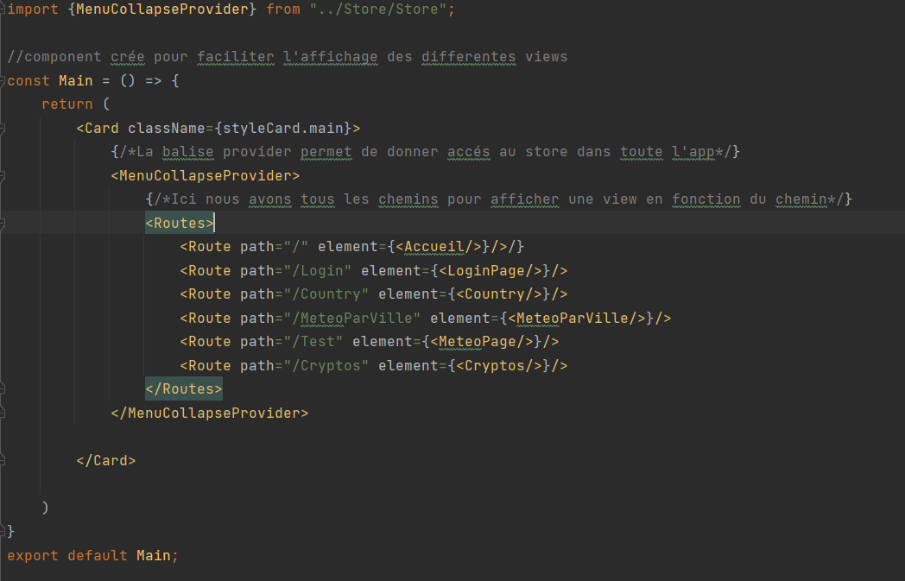

# Points acquis

* React est composé par des components donc nous sommes libres d'en créer une infinité pour ensuite les affciher dans app.js

   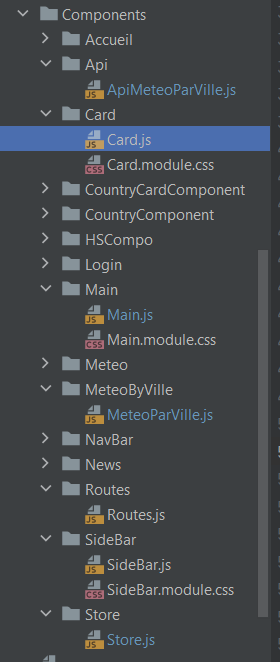

* J'ai compris ce que sont les props et comment les utiliser.
Elles servent a afficher les champs de l'object comme on veut dans la view

   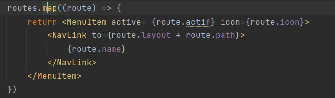

* Je trouve le .map() trés intéressant car il nous permet de parcourrir les données d'un tableau ou d'un object pour qu'on puisse les afficher comme on veux.
Le  .map() utilise un tableau ou object pour en créer un autre

   

* Pour avoir accés au routeur il faut englober app avec BrowserRouter

   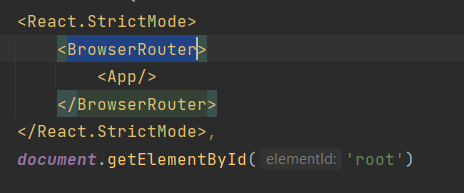

* Children
Props.children sert a dire au parent que l'on veut qu'il affiche tous les components qui sont a l'intérieure de lui

   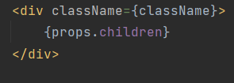

# Points a progrésser

* Store 
Je n'ai pas saisi comment on utilise un store même si je sais a quoi il sert
Je voulais m'en servir pour accéder a un boolean depuis differents componants

   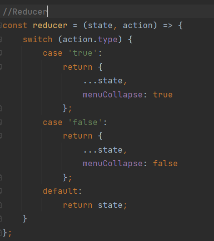

* CSS

Même si j'estime avoir bien progréssé dans ce qui concerne le css, je trouve que je suis encore loin d'avoir un bon niveau 

# Ressenti du cours

* Même si le developpement web n'est pas mon fort j'estime que moi et mon groupe, nous avons bien travaillé.
* Un cours interressant qui m'a premis de connaitre les notions de base de react
* Des explications un peu vagues même si je sais que cetait voulu pour nous forcer a utiliser la documentation
* J'ai aimé le fait de ne pas avoir l'impression d'être perdu, cest-a-dire, le fait que chaque groupe puisse avancer a son rythme
* Le fait d'etre en groupe c'est un point positif et aussi le fait d'avoir une trace de l'evolution du travail (git)

